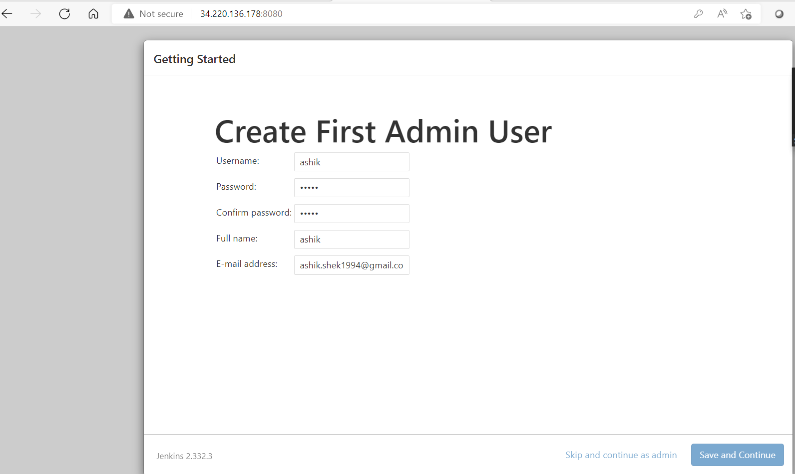
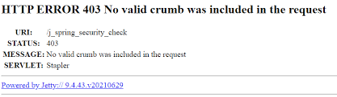
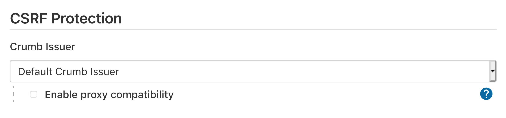
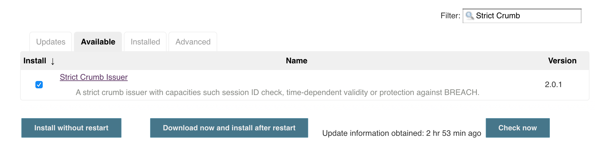
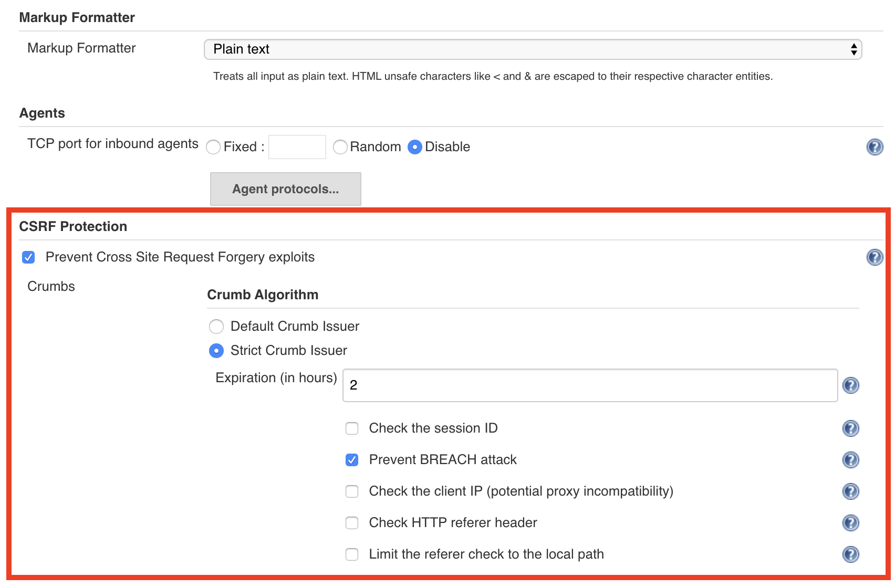
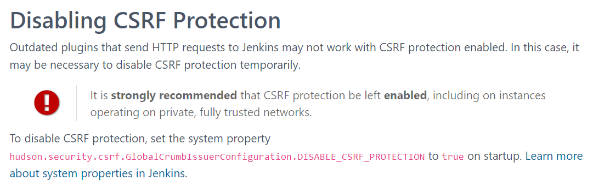
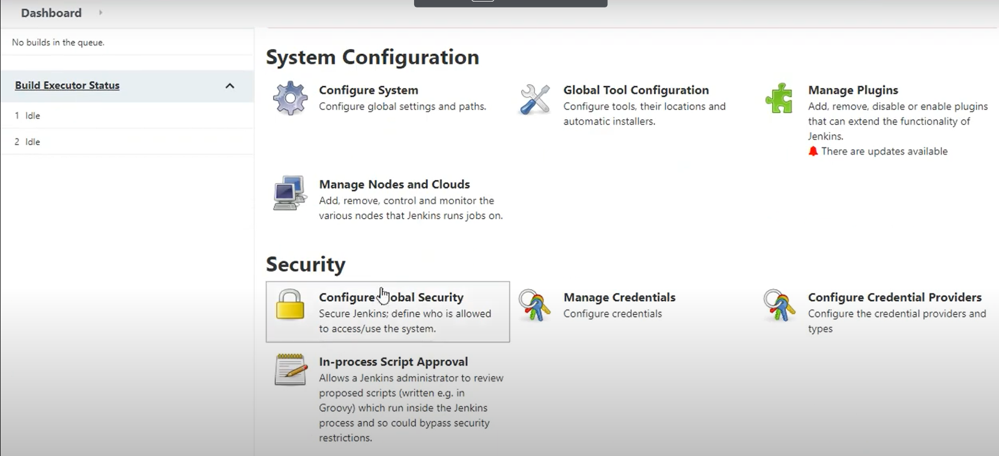
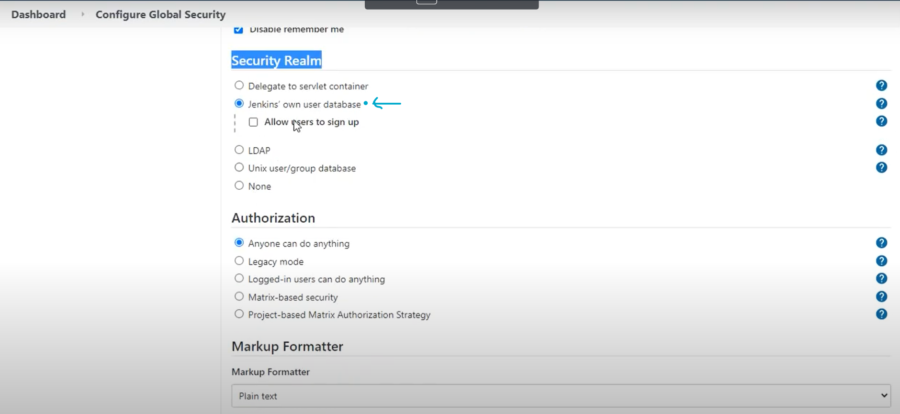
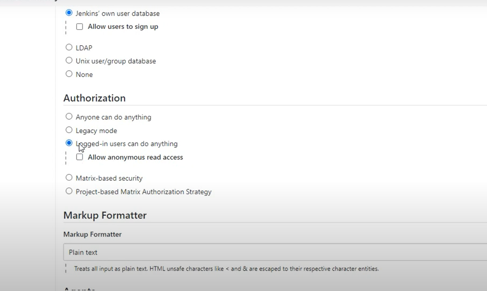

# crumbissue

--------------

## error1

    Save and Continue button not highlighted


## error2  

    what ever we try to do in jenkins UI following error raises


### We can fix this issue by

    1. CSRF protection
    
    2. change in jenkins/config.xml

* **_1.1_CSRF Protection__**

  * 
  * by eanbling proxy compatibility we can fix this

* **_1.2_CSRF Protection_Plugin__**
  * Incase if it is doesn't allowed to enable the proxy compatibility then
    >Under Manage Jenkins > Plugin Manager > Available, search for Strict Crumb Issuer Plugin, select Install
  * 

    ```
    Enable CSRF protection in Jenkins:

    a. Under Manage Jenkins > Configure Global Security, select Prevent Cross Site Request Forgery exploits.

    b. Under Crumb Algorithm, select Strict Crumb Issuer.

    c. Under Strict Crumb Issuer > Advanced, deselect Check the session ID
    ```

    * 
        > Made these change helps in resolve the issue

* **_2_Jenkins GitHub webhook error fix_**

 refer here for csrf protection official docs
        [csrf_protection_official_doc](https://www.jenkins.io/doc/book/security/csrf-protection/)



* login into jenkins master vm/ec2
* switch to user jenkins
* jenkins home directory is /var/lib/jenkins
* config.xml is present in its directory
* sudo vi config.xml

```xml
<?xml version='1.1' encoding='UTF-8'?>
<hudson>
  <disabledAdministrativeMonitors/>
  <version>2.332.3</version>
  <numExecutors>2</numExecutors>
  <mode>NORMAL</mode>
  <useSecurity>true</useSecurity>
  <authorizationStrategy class="hudson.security.FullControlOnceLoggedInAuthorizationStrategy">
    <denyAnonymousReadAccess>true</denyAnonymousReadAccess>
  </authorizationStrategy>
  <securityRealm class="hudson.security.HudsonPrivateSecurityRealm">
    <disableSignup>true</disableSignup>
    <enableCaptcha>false</enableCaptcha>
  </securityRealm>
  <disableRememberMe>false</disableRememberMe>
  <projectNamingStrategy class="jenkins.model.ProjectNamingStrategy$DefaultProjectNamingStrategy"/>
  <workspaceDir>${JENKINS_HOME}/workspace/${ITEM_FULL_NAME}</workspaceDir>
  <buildsDir>${ITEM_ROOTDIR}/builds</buildsDir>
  <jdks/>
  <viewsTabBar class="hudson.views.DefaultViewsTabBar"/>
  <myViewsTabBar class="hudson.views.DefaultMyViewsTabBar"/>
  <clouds/>
  <quietPeriod>5</quietPeriod>
  <scmCheckoutRetryCount>0</scmCheckoutRetryCount>
  <views>
    <hudson.model.AllView>
      <owner class="hudson" reference="../../.."/>
      <name>all</name>
      <filterExecutors>false</filterExecutors>
      <filterQueue>false</filterQueue>
      <properties class="hudson.model.View$PropertyList"/>
    </hudson.model.AllView>
  </views>
  <primaryView>all</primaryView>
  <slaveAgentPort>-1</slaveAgentPort>
  <label>master</label>
  <crumbIssuer class="hudson.security.csrf.DefaultCrumbIssuer">
    <excludeClientIPFromCrumb>true</excludeClientIPFromCrumb>
  </crumbIssuer>
  <nodeProperties/>
  <globalNodeProperties/>
  <nodeRenameMigrationNeeded>false</nodeRenameMigrationNeeded>
</hudson>
```

in this at last we need to change:

    _1. hudson.security.csrf.DefaultCrumbIssuer  set to false which is true in xml_**
    2. usesecurity set to false
    3. commenting authorizationStrategy,securityRealm

```xml
<!--<authorizationStrategy class="hudson.security.FullControlOnceLoggedInAuthorizationStrategy">
    <denyAnonymousReadAccess>true</denyAnonymousReadAccess>
  </authorizationStrategy>
  <securityRealm class="hudson.security.HudsonPrivateSecurityRealm">
    <disableSignup>true</disableSignup>
    <enableCaptcha>false</enableCaptcha>
  </securityRealm> -->
```

save and quit (:wq)

sudo systemctl restart jenkins

now it allows to in jenkins ui so enter into jenkins UI

1. manage jenkins > configure global security



2. security realm tick on own user database



3. tick on logged in isers can do anything, dis allow the anonymous users to read acess


logout and login

* _**issue solved!!!!!!!!!!!**_

we can fix this by github webhooks too......
